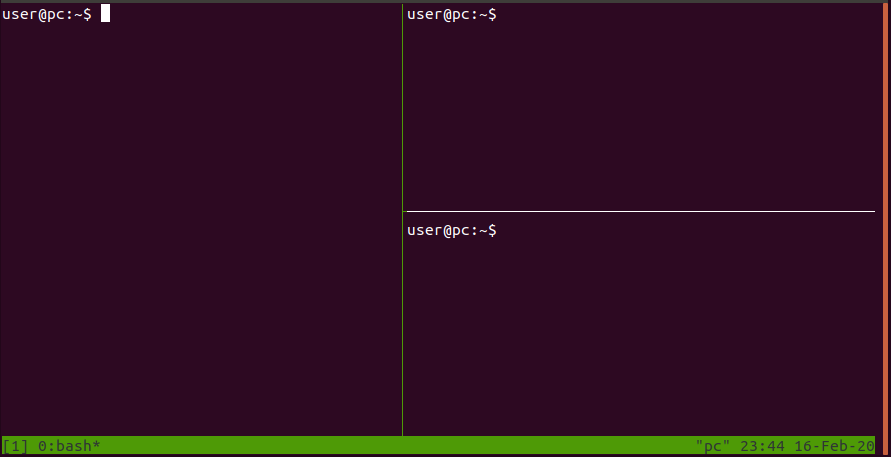
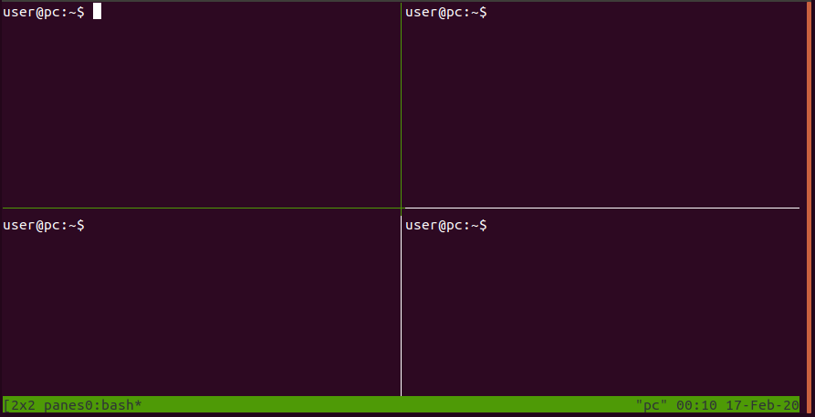
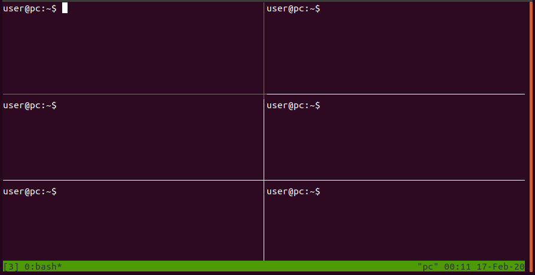

## tmux session with multiple panes
created: 16-02-2020

The terminal multiplexer [tmux](tmux.github.io) allows to open multiple terminal sessions in a single window. 

\
### one pane left, two panes right


Create a executable shell script with the following content:
```bash
#!/bin/sh
tmux new-session \; split-window -h \; split-window -v \; attach
```

<br/>
### two panes left, two panes right


Create a executable shell script with the following content:
```bash
#!/bin/sh
tmux new -s '2x2 panes' \; split-window -h \; split-window -v \; select-pane -t 0 \; split-window -v \; attach
```


### three panes left, three panes right


Create a executable shell script with the following content:
```bash
#!/bin/sh
tmux new-session \; split-window -p 66 \; select-pane -t 1 \; split-window -v \; select-pane -t 0 \; split-window -h \; select-pane -t 2 \; split-window -h \; select-pane -t 4 \; split-window -h \; select-pane -t 0
```
